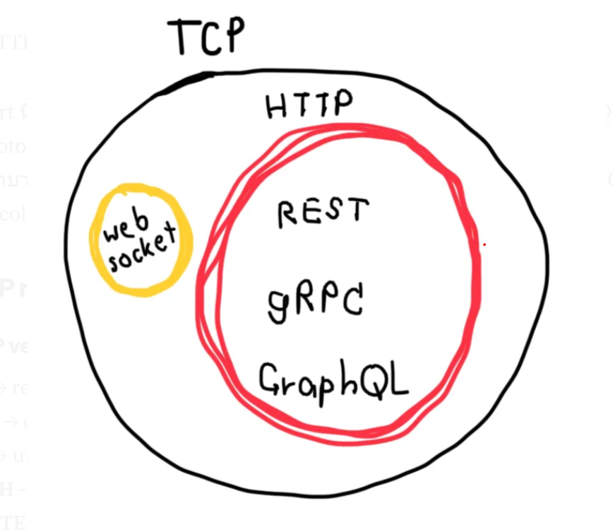
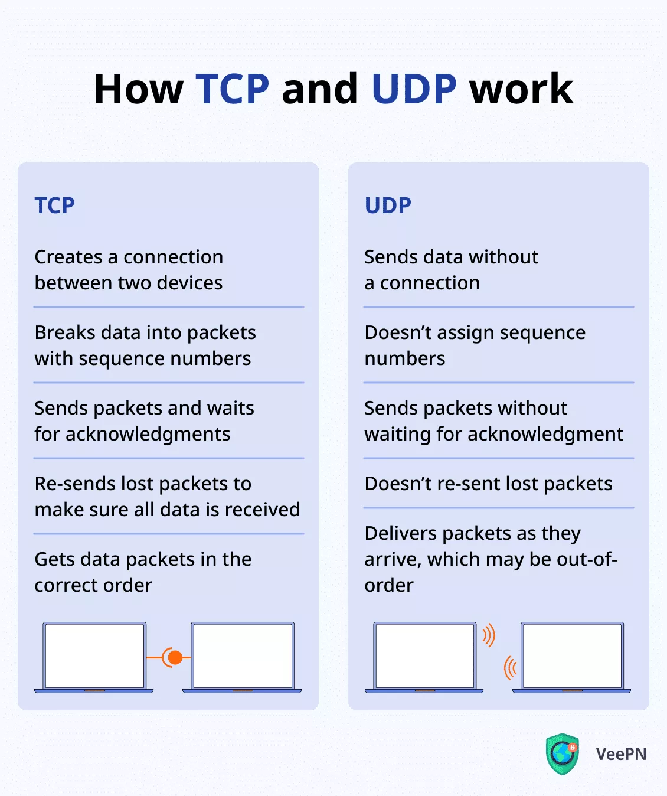

# 1 TCP and UDP

**TCP** is the most common protocol when developing distributed systems.

Transmission Control Protocol (TCP) is a communication protocol focused on accurate data transfers. It makes sure that every packet of data sent is received correctly and in the right order, by verifying and re-transmitting any lost or corrupted packets.

Pros

- Reliable
- Ordered
- Error-checked

Cons

- Slower compare to other protocols

**UDP** is a communication protocol focused on speedy data transfers. Unlike TCP, it doesn’t provide error checking or re-transmission of lost packets, which means some data might get lost or delivered out of order.

Pros

- Fast

Cons

- Only good when there's a constant stream of data.

# HTTP

Layer 7 - application. Request-response protocol

HTTP verbs / methods

- GET → read **should not change anything in the entity**
- POST → create
- PUT → update
- DELETE → delete

HTTP status codes

- 1xx → Information e.g. 100 Continue
- 2xx → Successful e.g. 201 OK, 200 Create
- 3xx → Redirect e.g. 301 Move permanent
- 4xx → Client Error e.g. 401 Unauthorized, 403 Forbidden, 404 Not found
- 5xx → Server Error e.g. 500 Internal Server Error, 503 Server Unavailable

# RESTfulness

RESTful URLs
- METHOD /[resource/id]. Example: GET /users/123

RESTful URLs - nested resources
- METHOD /[resource/id]/[resource/id]. Example: DELETE /users/123/books/567

RESTful URLs - state
- METHOD /[resource/id]/[action]. Example PUT /users/567/disable, PUT /users/567/enable

RESTful URLs - pagination
- METHOD /[resource/id]/?limit=x&offset=Y. Example GET /books?limit=50&offset=100

# Websockets

client only have connect to server first but only once when the connection is established, both the server and the client can begin sending messages simultaneously. 

It is Bidirectional Communication. WebSockets allow both the client and server to send data to each other at any time, without the client needing to constantly request updates.

Build on top of TCP

Advantages:

Real-time Applications and connection is established only once.

DisAdvantages:

- More complicated to implement than HTTP.
- May not have the best support in some languages.
- Unlike REST, need to reinvent the protocol every time

# GRPC

First let's talk about what is RPC(Remote Procedure Call).

A **local procedure call** is a function call within a process to execute some code. A **remote procedure call** enables one machine to invoke some code on another machine as if it is a local function call from a user’s perspective.

gRPC is built on top of HTTP/2 to provide a high-performance foundation at scale.

The core of GRPC is the use of **Protocol Buffers** as its data interchange format which are a **very efficient binary encoding format. It is much faster than JSON**.

**Protocol Buffers**

Protocol Buffers is a language-agnostic(focusing on the problem or task at hand, rather than being bound to a specific programming language) and platform-agnostic mechanisms for encoding structured data.

gRPC uses Protocol Buffers to encode and send data over the wire by default. While gRPC could support other encoding formats like JSON.

Protocol Buffers provide several advantages that make it the encoding format of choice for gRPC. Protocol Buffers support strongly-typed schema definitions.

The structure of the data over the wire is defined in a proto file. Protocol Buffers provide broad tooling support to turn the schema defined in the proto file into data access classes for all popular programming languages.

A gRPC service is also defined in a proto file by specifying RPC method parameters and return types. The same tooling is used to generate gRPC client and server code from the proto file.

Developers use these generated classes in the client to make RPC calls, and in the server to fulfil the RPC requests.

.png>)

**How does gRPC Work**

Let’s consider we have two services which are Order Service and Payment service. The Order service is the gRPC client, and the Payment Service is the gRPC server.

When the Order Service makes a gRPC call to the Payment Service, it invokes the client code generated by gRPC tooling at build time. This generated client code is called a client stub. gRPC encodes the data passed to the client stub into Protocol Buffers and sends it to the low-level transport layer.

gRPC sends the data over the network as a stream of HTTP/2 data frames. Because of binary encoding and network optimization, gRPC is said to be 5 times faster than JSON.

The payment service receives the packets from the network, decodes them, and invokes the server application. The result returned from the server application gets encoded into Protocol Buffers and sent to the transport layer.

.png>)

# GraphQL

Released by facebook to solve two issues REST has which is Overfecthing and Underfetching.

**Overfecthing**

Example: You call /api/user/123 and get the entire user object, including address, phone number, and more, even though you only need the user's name and email.

In GraphQL, the client defines the exact fields it wants:

    client side:

    query {
        user(id: "123") {
            name
            email
        }
    }

    server return:

    {
        "data": {
            "user": {
            "name": "John Doe",
            "email": "john@example.com"
            }
        }
    }

**Underfetching**

Example: You fetch /api/posts to get posts, but then have to fetch /api/users/1, /api/users/2, etc., to get authors.

In GraphQL, You can nest queries to fetch all needed data in one go:

    query {
        posts {
            title
            author {
                name
                email
            }
        }
    }

    {
        "data": {
            "posts": [
                {
                    "title": "GraphQL Basics",
                    "author": {
                        "name": "Alice",
                        "email": "alice@example.com"
                    }
                },
                ...
            ]
        }
    }

**Overview**

GraphQL is a query language and runtime for APIs. It provides a more efficient, powerful, and flexible alternative to REST.

It’s not tied to any specific database or backend, but rather describes how clients can request data.

- Based on HTTP
- Requests and responses are in JSON format
- Lets you define which fields to return.
- Lets you define which nested entities to return

**key concept**

1. Schema

- Defines the shape of the data and what queries/mutations are possible.
- Written in Schema Definition Language (SDL).

    Example:

    type User {
        id: ID!
        name: String!
        email: String!
    }

    type Query {
        user(id: ID!): User
    }

2. Queries

- Read-only operations to fetch data.
- You request exactly what you need — no more, no less.

Example:

    query {
        user(id: "1") {
            name
            email
        }
    }

3. Mutations
Used to modify data (create, update, delete).

Example:

    mutation {
        createUser(name: "Alice", email: "alice@example.com") {
            id
            name
        }
    }

**Protocol Flow**

1) Client sends an HTTP request to the GraphQL endpoint (usually /graphql).

2) Request body includes:

    - query: The GraphQL query or mutation
    - variables (optional): Dynamic inputs
    - operationName (optional): If multiple operations are defined

3) Server parses the query, validates it against the schema, calls resolvers, and returns a JSON response.